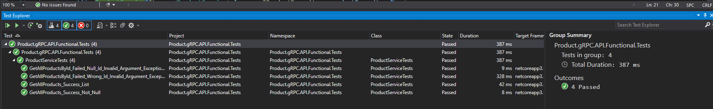
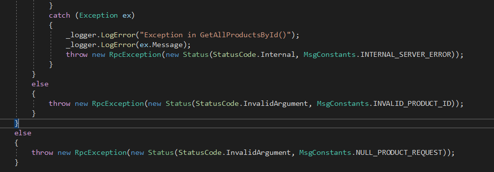
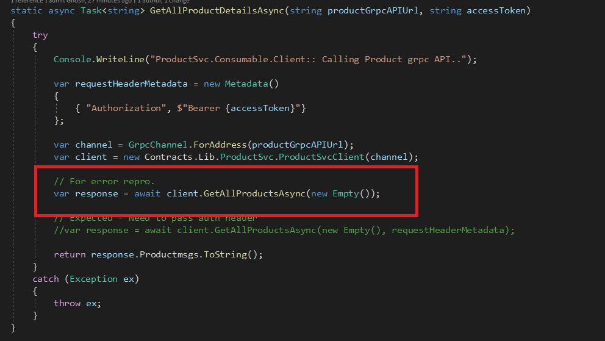
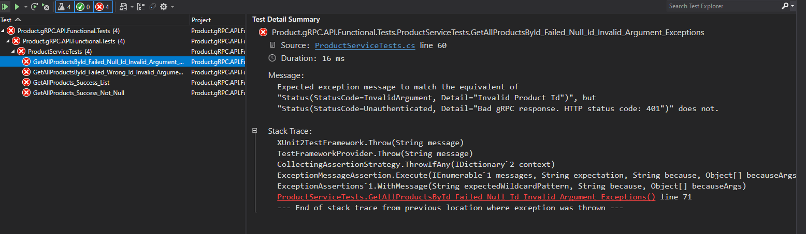
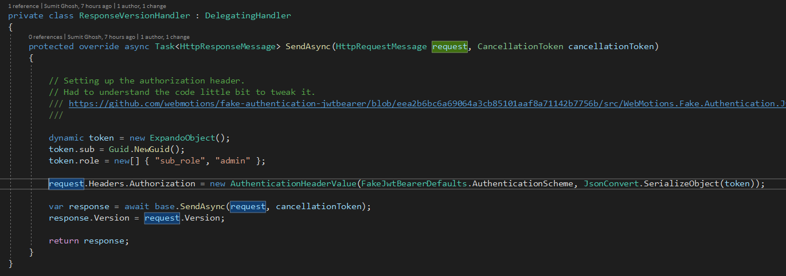

# gRPCAzureADAuth
gRPC client server sample using Azure AD as identity provider.

***```Application Facts```*** :

- There are 3 components in this solution : 
    - Contracts.Lib (*holds all contracts proto files*)
    - Product.gRPC.API (*custom gRPC api component*)
    - ProductSvc.Consumable.Client (*console client component*)    

- Technology used - dotnet core 3.1

- Configurations are kept under *appsettings.json*. 

- Keys are exposed considering it as demo app.But it's not advisable for production purpose.

- Test Project for the Functional test of *Product.gRPC.API* service.


***```Code Walkthrough```*** :

- **Contracts.Lib** : 

    Project is the heart beat of both client and server. It contains **product.proto** file which has the definition of entire Product Service. It exposes following methods :

    ```C#
        rpc GetAllProducts (google.protobuf.Empty) returns (ProductListMsg);
        rpc GetAllProductsById (ProductIdMsg) returns (ProductListMsg);
    ```

    where interesting thing to look at message type *"ProductListMsg"* contains repetative property type of *"ProductMsg"* It's similar like returning a IEnumerable of *"ProductMsg"*

- **Product.gRPC.API** :

    Project contains server side implementation of Product gRPC Service. *ProductService.cs* class extends *ProductSvc.ProductSvcBase* and implements required methods which would be exposed as an API. 

    For e.g :
    
    <details>

    <summary>Product Service related code snippet </summary>
    <p>


    ```C#
        // Original method gets generated by : public static partial class ProductSvc

        [grpc::BindServiceMethod(typeof(ProductSvc), "BindService")]
        public abstract partial class ProductSvcBase
        {
        public virtual global::System.Threading.Tasks.Task<global::Contracts.Lib.ProductListMsg> GetAllProducts(global::Google.Protobuf.WellKnownTypes.Empty request, grpc::ServerCallContext context)
        {
            throw new grpc::RpcException(new grpc::Status(grpc::StatusCode.Unimplemented, ""));
        }

        public virtual global::System.Threading.Tasks.Task<global::Contracts.Lib.ProductListMsg> GetAllProductsById(global::Contracts.Lib.ProductIdMsg request, grpc::ServerCallContext context)
        {
            throw new grpc::RpcException(new grpc::Status(grpc::StatusCode.Unimplemented, ""));
        }

        }
        
        /// Overriden methods :
        public override async Task<ProductListMsg> GetAllProducts(Empty request, ServerCallContext context)
        {
            // Logic goes in here.
        }
    ```

    </p>
    </details>


- **ProductSvc.Consumable.Client** :

    Project contains client related code which actually fetches access token from Azure AD and make the necessary call to gRPC API with necessary parameters. 


- **Product.gRPC.API.Functional.Tests** :

    This is the test project for "Product.gRPC.API" service component as the name suggests.
    Test runs can be seen as per below :

    

    
    To perform functional test, we have used *HostBuilder* within *Microsoft.AspNetCore.TestHost* itself and as we need use Http2 so we have created a new hanlder for hosting the gRPC Service. We would also need to make sure that we have Authorization header been enabled in there. So for that we have used *WebMotions.Fake.Authentication.JwtBearer* and enabled Auth header when a new request gets passed on to the server.

    ```C#
        protected override async Task<HttpResponseMessage> SendAsync(HttpRequestMessage request, CancellationToken cancellationToken)
            {

                // Setting up the authorization header. 
                // Had to understand the code little bit to tweak it. 
                /// https://github.com/webmotions/fake-authentication-jwtbearer/blob/eea2b6bc6a69064a3cb85101aaf8a71142b7756b/src/WebMotions.Fake.Authentication.JwtBearer/HttpClientExtensions.cs#L86
                /// 

                dynamic token = new ExpandoObject();
                token.sub = Guid.NewGuid();
                token.role = new[] { "sub_role", "admin" };

                request.Headers.Authorization = new AuthenticationHeaderValue(FakeJwtBearerDefaults.AuthenticationScheme, JsonConvert.SerializeObject(token));

                var response = await base.SendAsync(request, cancellationToken);
                response.Version = request.Version;

                return response;
            }
    ```

    That way we don't need to pass on any specific header during the call of the specific service methods.


**```Exception Handling & Logging :```**

Each server side methods handles proper proper execptions and returns back right status code. 



For logging console has been used which can be extended later.

**```Possible Errors & Fixes :```**

*1)*

```json

 User profile is available. Using 'C: as key repository and Windows DPAPI to encrypt keys at rest. 
. Microsoft . AspNetCore . Hosting. DiagnosticsC6] 
Application startup exception 
System. InvalidOperationException: Unable to find the required services. Please add all the required services by calling 'IServiceC011ection.AddAuthorization' inside the call to 
plication startup code. 
```

This could be because you have missed out adding Authorization service within service collection. 


*2)* 

```json

  InvalidOperationException: Endpoint gRPC - /product.service.ProductSvc/GetA11Products contains authorization metadata, but a middleware was not found that supports authorization   
```

This could be because you might have forgot to add middleware in your services *Startup.cs* section. 


*3)*

```json
Client Side :
-----------------

Grpc.Core.RpcException: Status(StatusCode=Unauthenticated, Detail="Bad gRPC response. HTTP status code: 401")
   at ProductSvc.Consumable.Client.Program.GetAllProductDetailsAsync(String productGrpcAPIUrl, String accessToken) in D:\projects\sughosneo-github\repos\gRPCAzureADAuth\Src\Clients\ProductSvc.Consumable.Client\Program.cs:line 132
   at ProductSvc.Consumable.Client.Program.Main(String[] args) in D:\projects\sughosneo-github\repos\gRPCAzureADAuth\Src\Clients\ProductSvc.Consumable.Client\Program.cs:line 27

Service Side :
-----------------


info: Microsoft.AspNetCore.Hosting.Diagnostics[1]
      Request starting HTTP/2 POST https://localhost:5001/product.service.ProductSvc/GetAllProducts application/grpc
info: Microsoft.AspNetCore.Authorization.DefaultAuthorizationService[2]
      Authorization failed.
info: Microsoft.AspNetCore.Authentication.JwtBearer.JwtBearerHandler[12]


```

This could be because of client hasn't passed header in the API request as it has shown below:



Fix would be passing "Authorization" header value with request. 


*4)*

During the modification of test cases if it fails with following error. 




Then it could be beacuse of authorization header is not set along with Http request. Either you pass it on in every service method request or you include that in middleware. Like as per below :


