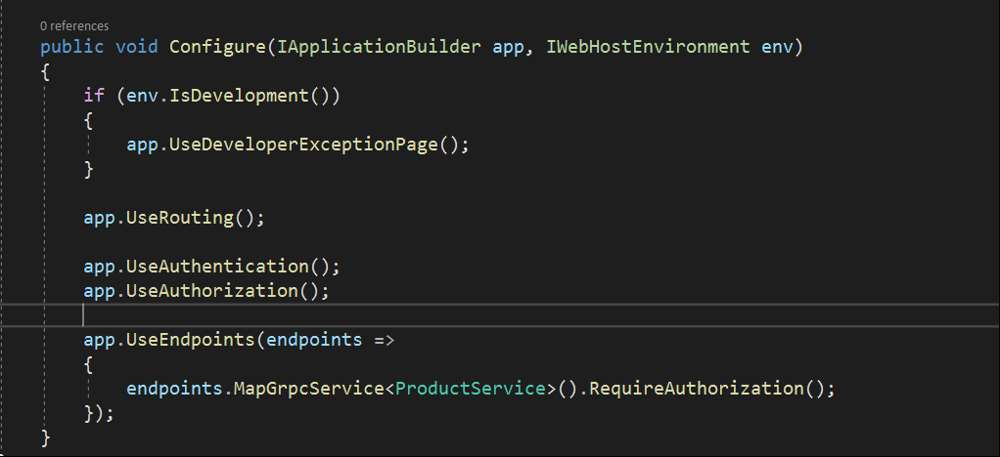

# gRPCAzureADAuth
gRPC client server sample using Azure AD as identity provider.

**```Errors & Fixes```**

*1)*

```HTML
 User profile is available. Using 'C: as key repository and Windows DPAPI to encrypt keys at rest. 
. Microsoft . AspNetCore . Hosting. DiagnosticsC6] 
Application startup exception 
System. InvalidOperationException: Unable to find the required services. Please add all the required services by calling 'IServiceC011ection.AddAuthorization' inside the call to 
plication startup code. 
```

This could be because you have missed out adding Authorization service within service collection. 



*2)* 

```HTML
  InvalidOperationException: Endpoint gRPC - /product.service.ProductSvc/GetA11Products contains authorization metadata, but a middleware was not found that supports authorization   
```

This could be because you might have forgot to add middleware in your services *Startup.cs* section. 


*3)*

